# 🥃 Vendor Performance & Profitability Analysis

<p align="center">
  <b>An end-to-end data analytics pipeline</b> — from a 15.6M-row relational warehouse to statistically validated business recommendations — built to answer one question for a multi-store liquor retail chain:<br/>
  <i>which vendors and brands are quietly bleeding profit, and which ones deserve more shelf space?</i>
</p>

<p align="center">
  <b>15.6M+</b> raw records&nbsp;&nbsp;·&nbsp;&nbsp;<b>119</b> vendors analyzed&nbsp;&nbsp;·&nbsp;&nbsp;<b>198</b> brands flagged for pricing action&nbsp;&nbsp;·&nbsp;&nbsp;<b>$2.71M</b> in locked inventory identified
</p>

<p align="center">


</p>

---

## Table of Contents
- [Overview](#overview)
- [Dashboard Preview](#dashboard-preview)
- [Tech Stack](#tech-stack)
- [Architecture](#architecture)
- [Dataset at a Glance](#dataset-at-a-glance)
- [Exploratory Data Analysis](#exploratory-data-analysis)
- [Key Insights and Findings](#key-insights-and-findings)
- [Recommendations](#recommendations)
- [Repository Structure](#repository-structure)
- [Getting Started](#getting-started)
- [Future Improvements](#future-improvements)
- [Author](#author)

---

## Overview

Effective inventory and vendor management can make or break margins in retail and wholesale distribution. This project analyzes a **multi-store liquor retail chain's** full purchase-to-sale lifecycle to answer five concrete business questions:

- 🎯 Which **brands** are underpriced or under-promoted relative to their margin potential?
- 🏭 Which **vendors** does the business depend on too heavily?
- 📦 Does **bulk purchasing** actually lower unit costs — and by how much?
- 🐌 Which vendors are sitting on **slow-moving, cash-locking inventory**?
- 📊 Is the profitability gap between top and bottom vendors **real, or just noise**?

The project spans the full analytics lifecycle — relational data modeling in SQL, a Python/Pandas ETL pipeline, exploratory analysis, formal statistical hypothesis testing, and an executive Power BI dashboard — turning **15.6M+ raw transactional records** into a **10-page, decision-ready report**.

---

## Dashboard Preview

<p align="center">
  
</p>

The Power BI dashboard consolidates the entire analysis into a single executive view:

| KPI | Value |
|---|---|
| 💰 Total Sales | **$441.41M** |
| 🛒 Total Purchases | **$232.78M** |
| 📈 Gross Profit | **$134.07M** |
| 📊 Overall Profit Margin | **39.38%** |
| 📦 Capital Locked in Unsold Inventory | **$2.71M** |

It surfaces top/bottom vendors and brands by sales, purchase concentration by vendor, and a live scatter of every vendor's margin profile — turning "something feels off" into "here's exactly who, and why" on a single screen.

---

## Tech Stack

| Layer | Tools |
|---|---|
| **Data Storage** | SQLite (relational warehouse), SQLAlchemy (ORM / ingestion) |
| **ETL & Transformation** | Python, Pandas, NumPy, SQL (CTEs, multi-table joins) |
| **Statistical Analysis** | SciPy (`ttest_ind`, confidence intervals), Welch's t-test |
| **Visualization** | Matplotlib, Seaborn |
| **Environment** | Jupyter Notebook |
| **Reporting / BI** | Power BI (interactive dashboard), PDF report |
| **Pipeline Hygiene** | Python `logging` module for run-level observability |

---

## Architecture

The core design decision: pre-aggregate a **vendor × brand analytical mart** once in SQL, instead of re-running expensive multi-million-row joins every time someone opens the dashboard.

```mermaid
flowchart LR
    A[("Raw CSVs<br/>purchases · sales · invoices<br/>inventory snapshots")] --> B["ingestion_db.py<br/>SQLAlchemy ETL"]
    B --> C[("inventory.db<br/>6 tables · 15.6M+ rows")]
    C --> D["get_vendor_summary.py<br/>CTE-based SQL aggregation"]
    D --> E[("vendor_sales_summary<br/>10,692 vendor-brand rows")]
    E --> F["exploratory_data_analysis.ipynb<br/>profiling and cleaning"]
    F --> G["vendor_performance_analysis.ipynb<br/>correlation · hypothesis testing · segmentation"]
    G --> H[("Analysis-ready extract<br/>8,564 records")]
    H --> I["Power BI Dashboard"]

    style I fill:#F2C811,stroke:#333,color:#000
    style C fill:#07405E,stroke:#333,color:#fff
    style E fill:#07405E,stroke:#333,color:#fff
    style H fill:#07405E,stroke:#333,color:#fff
```



The SQL layer (`get_vendor_summary.py`) does the heavy lifting with three CTEs — `FreightSummary`, `PurchaseSummary`, and `SalesSummary` — joined once into a single vendor-brand grain table, which every downstream notebook and the dashboard then reads from directly.

---

## Dataset at a Glance

| Table (SQLite) | Rows | What it holds |
|---|---:|---|
| `sales` | 12,825,363 | Line-item sales transactions across every store |
| `purchases` | 2,372,474 | Line-item purchase transactions from vendors |
| `end_inventory` | 224,489 | Period-end stock snapshot, every store |
| `begin_inventory` | 206,529 | Period-start stock snapshot, every store |
| `purchase_prices` | 12,261 | Vendor–brand reference prices & volumes |
| `vendor_invoice` | 5,543 | Invoice-level freight, quantity & approval data |
| **`vendor_sales_summary`** *(derived)* | 10,692 → **8,564** | Vendor–brand analytical mart, before → after cleaning |

**Cleaning rules applied** before analysis: rows were dropped where `GrossProfit ≤ 0`, `ProfitMargin ≤ 0`, or `TotalSalesQuantity = 0` — i.e., loss-making transactions and stock that was purchased but never sold, both of which would distort margin and turnover analysis.

---

## Exploratory Data Analysis

<p align="center">
  
</p>

Key correlation findings that shaped the rest of the analysis:

- **Purchase price is almost irrelevant to profitability** — correlation with `TotalSalesDollars` is `-0.01` and with `GrossProfit` is `-0.02`. Performance is driven by *volume*, not *unit price*.
- **Purchase and sales quantity move in near-lockstep** (`0.999` correlation) — inventory planning is efficient at the demand-forecasting level.
- **Profit margin has a weak negative correlation with total sales price** (`-0.18`) — higher revenue doesn't reliably mean higher margin, likely due to discounting on high-volume SKUs.
- **Stock turnover barely affects gross profit** (`-0.04`) but has a **moderate positive relationship with profit margin** (`0.40`) — moving inventory faster tracks with healthier margins, even if it doesn't directly drive absolute profit dollars.

<details>
<summary><b>📈 Additional EDA visuals — distributions, outliers, category counts</b></summary>
<br/>


*Distribution plots across all 16 numerical columns — most financial fields are heavily right-skewed, which is what motivated outlier-aware filtering before analysis.*


*Boxplots confirming extreme outliers in `FreightCost`, `PurchasePrice`, and `TotalPurchaseDollars` — consistent with a small number of bulk or premium transactions dominating those fields.*


*Transaction frequency by vendor and product. Volume leaders here aren't always revenue leaders — explored further below.*

</details>

---

## Key Insights and Findings

### 1 · Brands Needing Promotional or Pricing Adjustments

Brands were flagged when they fell in the **bottom 15% of total sales** (≤ $560.30) while sitting in the **top 15% of profit margin** (≥ 64.97%) — high-margin products nobody is buying enough of.

<p align="center">
  
</p>

**198 brands** met this criteria, including:

| Brand | Total Sales | Profit Margin |
|---|---:|---:|
| Santa Rita Organic Svgn Bl | $9.99 | 66.47% |
| Debauchery Pnt Nr | $11.58 | 65.98% |
| Concannon Glen Ellen Wh Zin | $15.95 | 83.45% |
| Crown Royal Apple | $27.86 | 89.81% |
| Sauza Sprklg Wild Berry Marg | $27.96 | 82.15% |

> 💡 These are prime candidates for bundling, featured placement, or modest price cuts to drive volume — the margin cushion is already there.

### 2 · Vendor Concentration Risk

<table>
<tr>
<td width="50%"></td>
<td width="50%"></td>
</tr>
</table>

The **top 10 of 119 vendors account for 65.69%** of all purchase dollars — with **Diageo North America Inc alone at 16.3%**. The remaining 109 vendors share just 34.31%.

<p align="center">
  
</p>

> ⚠️ This concentration is efficient for negotiating bulk pricing, but it's also a **single-point-of-failure risk** — a supply disruption at a top-2 vendor would hit the business far harder than losing any vendor in the long tail.

### 3 · Does Bulk Purchasing Actually Lower Unit Costs

<p align="center">
  
</p>

| Order Size | Avg. Unit Purchase Price |
|---|---:|
| Small | $39.07 |
| Medium | $15.49 |
| **Large** | **$10.78** |

Vendors buying in the largest quantity tier pay **~72% less per unit** than those buying small. The bulk-pricing incentive works exactly as intended — the open question is whether every vendor has the warehouse capacity and cash flow to exploit it.

### 4 · Vendors Sitting on Slow-Moving Inventory

**$2.71M** in capital is currently locked in unsold inventory. Two views of the same problem:

<table>
<tr>
<td width="50%" valign="top">

**Lowest stock turnover** *(units sold ÷ units purchased)*

| Vendor | Stock Turnover |
|---|---:|
| Alisa Carr Beverages | 0.62 |
| Highland Wine Merchants LLC | 0.71 |
| Park Street Imports LLC | 0.75 |
| Circa Wines | 0.76 |
| Dunn Wine Brokers | 0.77 |

</td>
<td width="50%" valign="top">

**Largest dollar value of unsold stock**

| Vendor | Unsold Inventory Value |
|---|---:|
| Diageo North America Inc | $722.21K |
| Jim Beam Brands Company | $554.67K |
| Pernod Ricard USA | $470.63K |
| William Grant & Sons Inc | $401.96K |
| E & J Gallo Winery | $228.28K |

</td>
</tr>
</table>

> Notice the overlap with Section 2 — the vendors the business depends on most (Diageo, Jim Beam) are also carrying the most dead stock in absolute dollars, even though their *turnover rate* looks fine. Scale hides the problem.

### 5 · Profit Margin: Top vs. Low-Performing Vendors

<p align="center">
  
</p>

| Vendor Tier | Mean Profit Margin | 95% Confidence Interval |
|---|---:|---:|
| Top vendors *(≥ 75th pct. sales)* | 31.17% | (30.74%, 31.61%) |
| Low vendors *(≤ 25th pct. sales)* | 41.55% | (40.48%, 42.62%) |

Counter-intuitively, the **lowest-selling vendors carry about 10 points more margin** than the highest-selling ones — a classic volume-vs-margin trade-off.

### 6 · Is That Difference Statistically Real

Two-sample **Welch's t-test** on profit margins between the two vendor tiers:

- **H₀:** No difference in mean profit margin between top and low-performing vendors
- **H₁:** A significant difference exists
- **Result:** t = **−17.67**, p < **0.0001** → **H₀ rejected**

The margin gap isn't sampling noise — top-selling and low-selling vendors are operating under genuinely different pricing models, which means they need genuinely different playbooks.

---

## Recommendations

- **Re-price or promote** the 198 low-sales/high-margin brands to convert margin cushion into volume.
- **Diversify the vendor base** — 65.69% purchase concentration in 10 vendors is a supply-chain risk worth actively managing.
- **Push more volume through large-order-size purchasing** wherever storage and cash flow allow, to capture the ~72% unit-cost advantage.
- **Target the $2.71M in locked inventory** with clearance pricing or tighter reorder points, starting with Alisa Carr Beverages and Highland Wine Merchants.
- **Give top-performing vendors a cost-efficiency review** — they sell more but earn less per dollar. **Give low-performing vendors a distribution/marketing push** — they earn more per dollar but sell less.

---

## Repository Structure

```
vendor-performance-analysis/
│
├── README.md
├── requirements.txt
├── .gitignore
│
├── assets/                                 # Charts & dashboard images used in this README
│   ├── dashboard.png
│   ├── correlation-heatmap.png
│   ├── top10-vendors-brands.png
│   ├── vendor-concentration-donut.png
│   ├── pareto-vendor-contribution.png
│   ├── promo-pricing-opportunities.png
│   ├── bulk-purchase-unit-price.png
│   ├── profit-margin-confidence-interval.png
│   ├── distribution-plots.png
│   ├── outlier-boxplots.png
│   └── categorical-countplots.png
│
├── data/
│   ├── vendor_data_da/                     # Raw source CSVs (see Getting Started)
│   ├── vendor_sales_summary.csv            # Master cleaned analytical table (8,564 rows)
│   ├── sales.csv                           # Profitable vendor-brand extract
│   ├── customers.csv                       # Low stock-turnover vendor extract
│   └── BrandPerformance.csv                # Brand-level aggregated metrics
│
├── notebooks/
│   ├── exploratory_data_analysis.ipynb     # Table discovery + summary-table SQL design
│   └── vendor_performance_analysis.ipynb   # EDA, correlation analysis, hypothesis testing
│
├── scripts/
│   ├── ingestion_db.py                     # Loads raw CSVs → SQLite (inventory.db)
│   └── get_vendor_summary.py               # CTE-based vendor/brand aggregation + cleaning
│
├── reports/
│   └── vendor_optimization_report.pdf      # 10-page written findings & recommendations
│
└── logs/
    └── get_vendor_summary.log              # Pipeline run logs (generated)
```

---

## Getting Started

```bash
# 1. Clone the repository
git clone https://github.com/<your-username>/vendor-performance-analysis.git
cd vendor-performance-analysis

# 2. Create a virtual environment and install dependencies
python -m venv venv
source venv/bin/activate      # Windows: venv\Scripts\activate
pip install -r requirements.txt

# 3. Add the raw CSV extracts to data/vendor_data_da/
#    (begin_inventory, end_inventory, purchases, purchase_prices, sales, vendor_invoice)

# 4. Build the SQLite warehouse — run from the repository root
python scripts/ingestion_db.py

# 5. Run the vendor-wise aggregation pipeline
python scripts/get_vendor_summary.py

# 6. Explore the analysis
jupyter notebook notebooks/exploratory_data_analysis.ipynb
jupyter notebook notebooks/vendor_performance_analysis.ipynb

# 7. Open the .pbix file in Power BI Desktop for the live interactive dashboard
```

> All scripts use relative paths (`inventory.db`, `vendor_data_da/`), so run them from the repository root as shown above.

---

## Future Improvements

- ⏱ Automate the pipeline with Airflow or Prefect for scheduled refreshes instead of manual notebook runs.
- ☁️ Move from SQLite to a cloud warehouse (BigQuery, Snowflake, or Postgres) to support concurrent access and longer history.
- 🔮 Add a demand-forecasting model (e.g., Prophet or XGBoost) on top of `sales` to flag slow movers before they become dead stock.
- 🔔 Wire vendor-concentration and stock-turnover thresholds into automated Slack or email alerts.
- 🧪 Extend hypothesis testing to a full ANOVA across multiple vendor tiers instead of a two-group split.


